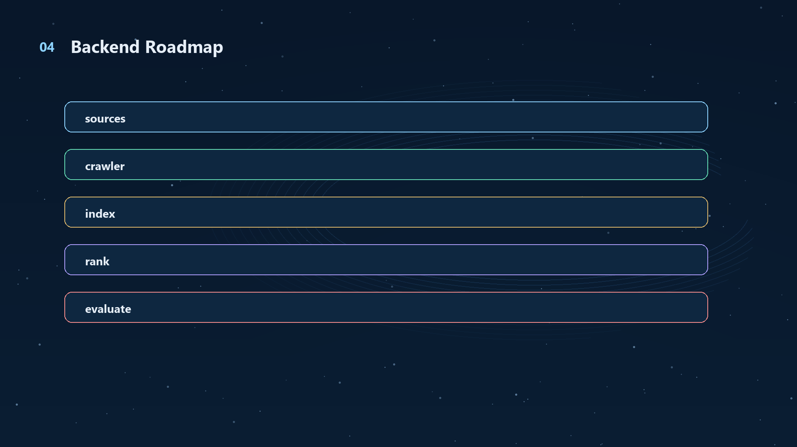
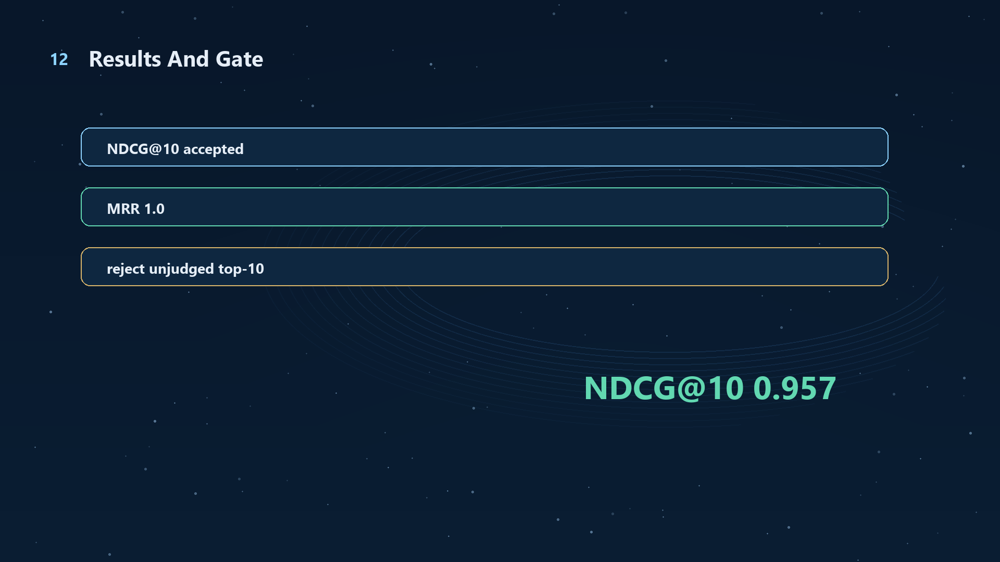

# Portfolio-Aware Search

Financial information retrieval for portfolios, not generic web search.

This repository is the **information foundation** for
[FinGPT-as-Feature-Generator](https://github.com/Sqaard/FinGPT-as-Feature-Generator).
Its crawler built a trusted financial evidence universe of **26,368 high-quality
document units**: official SEC filing sections, company IR releases, and macro
time-series observations. Those documents become the raw material for downstream
LLM feature extraction and PPO/RL portfolio experiments.

## What This Project Does

| Layer | What it does | Why it matters |
|---|---|---|
| **Crawler** | Finds, downloads, normalizes, hashes, timestamps, and deduplicates official financial documents. | FinGPT features are only useful if the source evidence is reliable and point-in-time safe. |
| **Search / IR** | Indexes documents with SQLite FTS/BM25 plus structured metadata and calibrated ranking. | Investors need the right filing, section, macro release, or company IR page quickly. |
| **Website** | Turns evidence into portfolio-aware folders, document pages, analyst charts, and LLM summaries. | The demo makes the retrieval layer inspectable instead of hiding it behind model outputs. |

## Corpus Built By The Crawler

The full corpus is reproducible from the crawler scripts. The heavy full-text
JSONL and SQLite index are not committed to GitHub; this repo includes a compact
demo subset plus the manifests/summaries needed to verify the build.

| Source family | Document units | Examples |
|---|---:|---|
| Official macro releases | **18,240** | FRED rates, spreads, VIX, CPI, labor, housing, oil |
| SEC filing sections | **6,356** | 10-K / 10-Q risk factors, MD&A, financial statements |
| SEC exhibits | **655** | 8-K earnings releases, investor materials |
| Company IR documents | **1,117** | earnings releases, press releases, presentations, reports |
| **Total trusted corpus** | **26,368** | 29 Dow-style equity tickers + market macro evidence |

Why these documents are high quality:

| Quality gate | Implementation |
|---|---|
| Official-source bias | SEC EDGAR, FRED, and official company IR/source-registry URLs are preferred. |
| Point-in-time safety | Every document has `available_at`; retrieval filters by `available_at <= decision_time`. |
| Stable identity | Each row has `doc_id`, `canonical_url`, `document_hash`, and duplicate cluster fields. |
| Structured fields | `source_type`, `matched_tickers`, `event_tags`, `risk_terms`, and timestamps are stored separately from text. |
| Auditable failures | Weak or blocked company IR sources are logged into source/vendor review queues instead of silently trusted. |



## Part 1: Crawler

The crawler is source-registry-first: it starts from reviewed official sources,
then writes normalized JSONL records with provenance.

Core crawler paths:

| Path | Purpose |
|---|---|
| `crawler/collect_sec_filings.py` | SEC filing collection. |
| `crawler/sec_section_parser.py` | Converts filings into section/exhibit retrieval units. |
| `crawler/company_source_archive_discovery.py` | Discovers dated official company IR archive pages. |
| `crawler/company_source_adapter_backfill.py` | Adapter/backfill layer for company IR sources that need source-specific logic. |
| `features/build_official_macro_documents.py` | Converts official macro series into dated document records. |
| `crawler/normalize_documents.py` | Normalizes raw records into the common schema. |

Minimal sample normalization:

```powershell
python crawler/normalize_documents.py `
  --input data/raw_documents/sample_documents.jsonl `
  --metadata data/processed_documents/ticker_metadata.csv `
  --source-registry data/source_registry/source_registry.csv `
  --output data/processed_documents/documents.jsonl
```

Company IR archive discovery example:

```powershell
python crawler/company_source_archive_discovery.py `
  --sources data/source_registry/official_company_source_urls_review_2026-05-13.csv `
  --metadata data/processed_documents/dow30_ticker_metadata.csv `
  --output-documents data/raw_documents/company_official_archive_documents.jsonl `
  --detail-manifest-output data/source_registry/company_official_archive_detail_manifest.csv `
  --source-manifest-output data/source_registry/company_official_archive_source_manifest.csv `
  --vendor-queue-output data/source_registry/company_official_archive_vendor_queue.csv `
  --summary-output data/source_registry/company_official_archive_summary.json `
  --start-year 2010 `
  --end-year 2023
```

## Part 2: Portfolio-Aware Search Website

The site is a local financial IR dashboard. It groups evidence into folders,
opens original-document pages, supports portfolio-aware search, and can run LLM
summaries if the user supplies a key through environment/session settings.

Run locally:

```powershell
python web_app.py --host 127.0.0.1 --port 8765
```

Open:

```text
http://127.0.0.1:8765
```

For a temporary class/demo tunnel:

```powershell
powershell -ExecutionPolicy Bypass -File .\deploy\cloudflare\start_public_demo.ps1
```

This repository intentionally commits a lightweight demo corpus:

```text
data/processed_documents/repo_demo_documents.jsonl
```

It contains **993** representative documents from the same trusted corpus so the
UI can run without a 300MB+ full corpus file.

## Ranking

The final web ranking is not "just newest first". It is a calibrated hybrid
ranker:

```text
BM25 full-text retrieval
  + entity/ticker matching
  + source-family intent routing
  + field/section preferences
  + recency and source-quality features
  + calibrated reranking from qrels
```

SQLite FTS stores text for fast BM25 lookup; structured fields store facts that
plain text search misses: ticker, source type, event tags, dates, duplicate
clusters, and source reliability.



## Evaluation

The search system is evaluated as IR, not by vibes. The current accepted run is
`web_search_calibrated_v19`, evaluated on **464 judged qrels**.

| Metric | Value |
|---|---:|
| Precision@5 | **1.000** |
| Precision@10 | **0.872** |
| NDCG@10 | **0.957** |
| MRR | **1.000** |

Qrels labels use a 0-3 scale:

| Label | Meaning |
|---:|---|
| 0 | Irrelevant |
| 1 | Weak fallback / mentions context |
| 2 | Useful evidence |
| 3 | Highly relevant, timely evidence |

## Repository Map

| Path | What is inside |
|---|---|
| `crawler/` | Source discovery, SEC parsing, company IR crawler, normalization |
| `indexing/` | Entity linking and SQLite/FTS index builder |
| `retrieval/` | Portfolio query builder and hybrid ranker |
| `evaluation/` | qrels, NDCG/MRR evaluation, active-review queues, calibration |
| `features/` | FinGPT handoff, text-feature prep, macro document builder |
| `web/` + `web_app.py` | Local website and HTTP API |
| `data/processed_documents/` | Small demo corpus + corpus build summaries |
| `data/source_registry/` | Official source registry and crawler coverage reports |
| `docs/` | Methodology, schema, handoff, deployment notes |

## Relationship To FinGPT-as-Feature-Generator

This repo does **not** train the trading/RL model. It supplies the evidence.

```text
Portfolio-Aware-Search
  -> trusted documents + ranked evidence bundles
  -> FinGPT-as-Feature-Generator
  -> numeric text features
  -> FinRL / PPO ablation experiments
```

In simple terms: this project decides **what the model is allowed to read**.
The next project decides **which structured signals can be extracted from it**.

## Not Included Yet

Live incremental crawling is intentionally not committed. The current public
repo is the stable historical/demo version: crawler, source registry, offline
IR evaluation, and local website.

