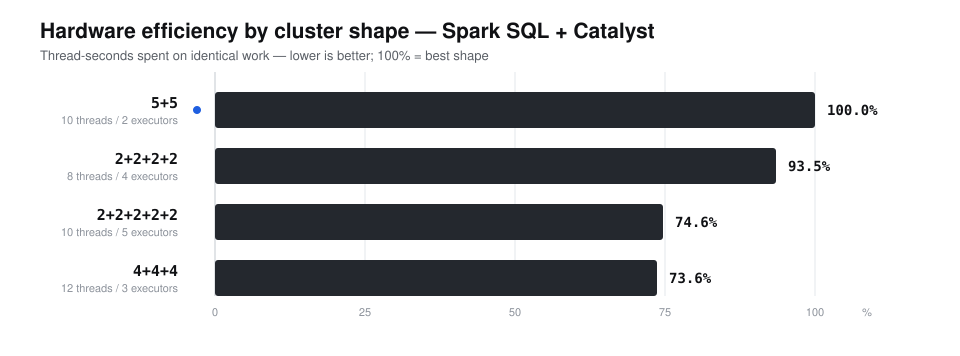
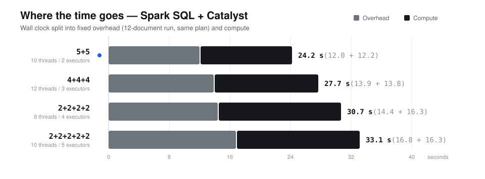
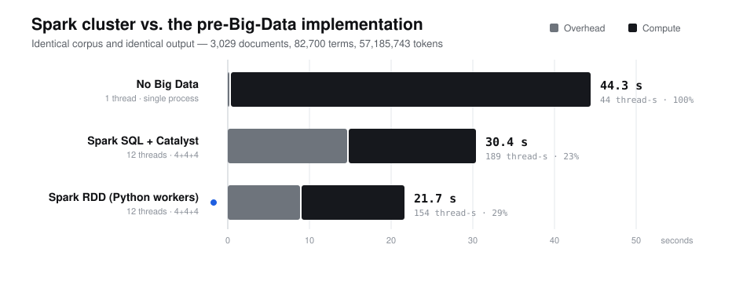
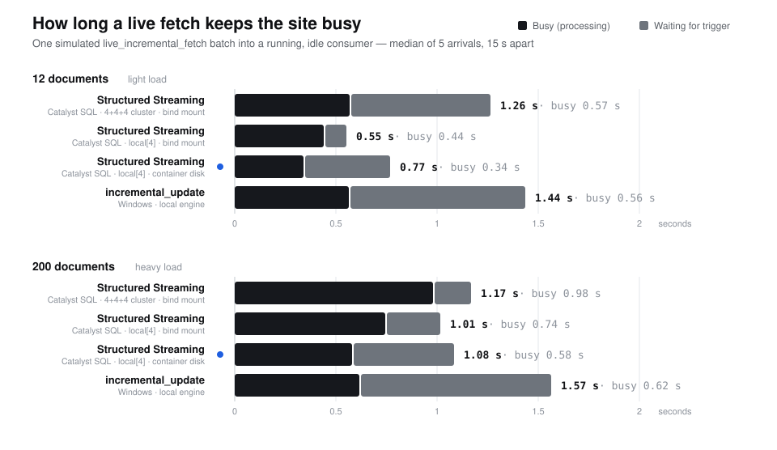

# Spark SQL + Catalyst: the cluster benchmarks, re-run

Measured 2026-09-11 on one host (AMD Ryzen 5 5500U, 6 cores / 12 SMT threads, Docker
Desktop on WSL2, Spark 3.5.3 standalone).

The "optimized architecture" replaces the Python-worker (RDD) path with native Spark SQL:
every per-document step — JSON parsing, the `FinancialDocument` defaults, tokenisation,
counting — is a Catalyst expression executed in the JVM; nothing is pickled to a Python
worker. Two jobs were ported:

* **BM25 statistics** — [`bigdata/jobs/sql_inverted_index.py`](../bigdata/jobs/sql_inverted_index.py),
  `python -m bigdata.run_inverted_index --api sql`;
* **corpus analytics for Structured Streaming** —
  [`bigdata/streaming/sql_analytics.py`](../bigdata/streaming/sql_analytics.py),
  `spark_structured_streaming --analytics sql`.

Both are **exact**: a fast-path guard proves, per record, that the SQL reproduces the Python
reference, and routes any record it cannot prove (nulls, non-string JSON values, non-canonical
timestamps, trailing JSON content, …) to the reference Python on the driver. On the benchmark
corpus (3,029 SEC filings, 364 MiB, 57,185,743 tokens, 82,700 terms) the Catalyst BM25 job's
`document_frequencies.csv`, `document_lengths.csv` and `bm25_stats.json` are byte-identical to
the RDD job's; on the 26,368-document PPO corpus every analytics field of every document
matches. Edge cases are pinned in `tests/test_sql_analytics.py` and `tests/test_sql_inverted_index.py`.

## 1. Cluster shape on the Catalyst job

The four shapes of the original experiment (same 6,000 MB total heap each), the same corpus,
the same method: median of three full-corpus runs at each shape's best partition count (one
warm-up discarded); overhead = the same plan and task count over 12 documents; compute = wall
clock − overhead; thread-seconds = compute × SMT threads; efficiency = the best thread-seconds /
this shape's. Every shape was verified on the master before it was measured.





| Config | Shape | Cores/exec | SMT | Heap/exec | Wall clock | Overhead | Compute | Thread-s | Efficiency |
|---|---|---|---|---|---|---|---|---|---|
| **A** | **5+5** | 5 | 10 | 3,000 MB | **24.2 s** | 12.0 s | 12.2 s | **122** | **100.0%** |
| C | 2+2+2+2 | 2 | 8 | 1,500 MB | 30.7 s | 14.4 s | 16.3 s | 130 | 93.5% |
| B | 2+2+2+2+2 | 2 | 10 | 1,200 MB | 33.1 s | 16.8 s | 16.3 s | 163 | 74.6% |
| D | 4+4+4 | 4 | 12 | 2,000 MB | 27.7 s | 13.9 s | 13.8 s | 165 | 73.6% |

Best partition counts: A 10, C 8, B 10, D 12. Source:
[`data/exports/bigdata/arch_experiment_sql.csv`](../data/exports/bigdata/arch_experiment_sql.csv)
and its `_summary.json`, `deploy/spark_cluster/run_arch_experiment.ps1 -Api sql`.

* **Fat executors win, and more clearly than on the RDD job.** A (two 5-core executors) leads
  on wall clock and on thread-seconds. The Catalyst job's fixed cost — code generation for the
  exactness-guard expressions, class loading, plan deserialization — is paid in every executor
  JVM: overhead grows from 12.0 s with 2 executors to 13.9 s with 3 and 16.8 s with 5.
* **The 12th thread does not pay.** D gets 20% more SMT threads than A and computes 13% slower:
  on 6 physical cores the extra threads are hyper-threads competing for the same cores.
* **Against the RDD run of the same table** (original experiment, a different day: D 21.0 s,
  A 23.1 s, B 27.8 s, C 29.6 s) the Catalyst job is not faster; the paired comparison on one
  shape is section 2.

## 2. Against the pre-Big-Data baseline

The same statistics built three ways, back to back in one thermal window: the original
single-process `indexing/build_sparse_index.py`, and the 4+4+4 cluster running the RDD job and
the Catalyst job. All three produce identical output.



| Architecture | Parallelism | Wall clock | Overhead | Compute | Thread-s | Efficiency |
|---|---|---|---|---|---|---|
| No Big Data | 1 thread | 44.3 s | 0.05 s | 44.2 s | 44.2 | 100% |
| Spark SQL + Catalyst — 4+4+4 | 12 threads | 30.4 s | 14.62 s | 15.8 s | 189.0 | 23.4% |
| Spark RDD (Python workers) — 4+4+4 | 12 threads | 21.7 s | 8.87 s | 12.8 s | 154.0 | 28.7% |

Median of three runs each (one warm-up discarded); overhead = the same job over 12 documents;
thread-seconds = compute × threads; efficiency = the cheapest thread-seconds / this row's.
Source: [`data/exports/bigdata/baseline_vs_spark.json`](../data/exports/bigdata/baseline_vs_spark.json),
`deploy/spark_cluster/bench_baseline_vs_sql.py`.

## 3. Live arrival: how long a fetch keeps the site busy

A streaming consumer is running and idle; `crawler/live_incremental_fetch.py` delivers a batch
of 12 (light) or 200 (heavy) documents, simulated as a reproducible random sample of the
production corpus. Paired: every consumer received the identical batch sequence, sizes
interleaved, one warm-up of each size discarded, arrivals 15 s apart, trigger / poll interval 1 s.
*Busy* is Spark's own `triggerExecution` (listing, planning, the job, the offset and commit
logs) or the tick's own time; *latency* adds the wait for the next trigger or poll.



| Consumer | 12 documents: latency / busy | 200 documents: latency / busy |
|---|---|---|
| incremental_update, local engine (Windows) | 1.44 / 0.56 s | 1.57 / 0.62 s |
| Structured Streaming, Catalyst SQL (Docker, 4+4+4) | 1.26 / 0.57 s | 1.17 / 0.98 s |
| Structured Streaming, Catalyst SQL (Docker, local[4], bind mount) | 0.55 / 0.44 s | 1.01 / 0.74 s |
| Structured Streaming, Catalyst SQL (Docker, local[4], container disk) | **0.77 / 0.34 s** | **1.08 / 0.58 s** |
| *before:* Structured Streaming, RDD / Python workers (Docker, 4+4+4) | 3.56 / 3.17 s | 3.92 / 3.45 s |

The last row is the earlier `--analytics full` run of the same experiment (same harness, a
different session), kept for reference. Source:
[`data/exports/bigdata/live_arrival_final.csv`](../data/exports/bigdata/live_arrival_final.csv)
and its `_summary.json`, `deploy/spark_cluster/bench_live_arrival.py`.

## What it shows

* **Streaming: Catalyst removes the fixed toll.** Per micro-batch Structured Streaming went
  from 3.2–3.5 s to 0.34–0.98 s. In local mode on container storage it is the fastest consumer
  (busy 0.34 s against 0.56 s for 12 documents; 0.58 s against 0.62 s for 200) and has the
  lowest latency. The distributed 4+4+4 cluster adds executor RPC and the Windows bind mount's
  listing: at live-batch sizes it ties on 12 documents and loses on 200.
* **Batch: Catalyst does not beat the RDD job here.** The BM25 build is tokenisation-bound:
  ~57 M strings materialised, lower-cased and de-duplicated. Warm, the Catalyst job computes as
  fast as the RDD job (~15 s); cold — and every run is a fresh application — it pays more fixed
  cost: code generation for the large exactness-guard expressions, class loading and plan
  deserialization on every executor (14–15 s over 12 documents, against 9 s). CPython's regex
  and dict are already C code, so removing the JVM↔Python hand-off buys little for this job.
* **The pre-Big-Data single process stays the most efficient** in thread-seconds; the cluster
  buys wall clock (1.5–2.0×) with 3.5–4.3× the hardware time.

## How the per-batch cost was brought down (streaming)

Measured, in order of effect: the extraction is built into the streaming query itself (built
inside `foreachBatch`, its large expression tree cost ~0.7 s of construction and analysis per
batch); the checkpoint's three metadata writes per trigger go through Hadoop's raw local file
system with the file-system checkpoint manager (~5 ms each instead of ~38 ms through the
checksummed `FileContext`); no Filter on the verdict (it was pushed below the JSON parse and
re-ran it per reference); one regex pass counts tokens without materialising them; guards are
cheap Jackson skip-parses instead of full-line regex scans.

## Caveats

* One host: "cluster" means Docker containers sharing 6 physical cores. Thread-seconds count
  SMT threads granted, and charge serial driver work (the final collect and assembly) as if it
  were parallel.
* Every batch run is a new Spark application, so JIT and code generation are paid inside the
  timed window, as they would be for a nightly job.
* The baseline runs on Windows CPython (NTFS), the cluster in Linux containers.
* Latency depends on the poll period; incremental_update's loop is interval + tick, hence its
  ~1.5 s latency against ~0.6 s of work. Busy time is the like-for-like measure.
* The original RDD shape table used `--native-read`, whose input split count is fixed by the
  file's block size (12 map tasks regardless of `--partitions`). The Catalyst runs honour the
  partition count exactly (`scan_tasks` is recorded) with AQE coalescing switched off.

## Reproduce

```bash
# 1. shapes (restarts the cluster per shape; ~25 min)
powershell -File deploy/spark_cluster/run_arch_experiment.ps1 -Api sql -Repeats 3
python deploy/spark_cluster/analyze_arch_experiment.py --csv data/exports/bigdata/arch_experiment_sql.csv
# 2. baseline, back to back on the 4+4+4 cluster
python deploy/spark_cluster/bench_baseline_vs_sql.py
python deploy/spark_cluster/plot_baseline_vs_spark.py
# 3. live arrival (each arm; see the script's docstring)
python deploy/spark_cluster/bench_live_arrival.py --consumer ss --ss-analytics sql --ss-master "local[4]" --ss-storage native --csv data/exports/bigdata/live_arrival_final.csv
python deploy/spark_cluster/analyze_live_arrival.py --csv data/exports/bigdata/live_arrival_final.csv
# exactness
docker compose -f deploy/spark_cluster/docker-compose.yml exec -T spark-master python3 -m unittest tests.test_sql_analytics tests.test_sql_inverted_index
docker compose -f deploy/spark_cluster/docker-compose.yml exec -T spark-master python3 deploy/spark_cluster/sql_analytics_parity.py
```
